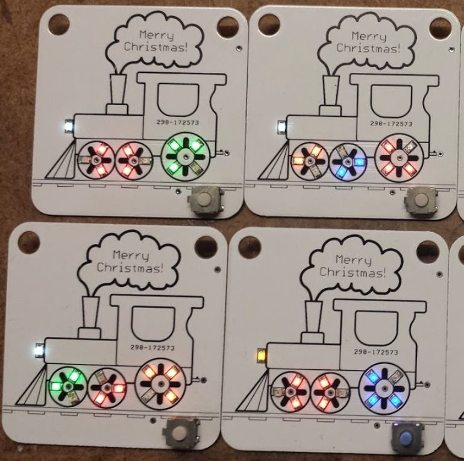
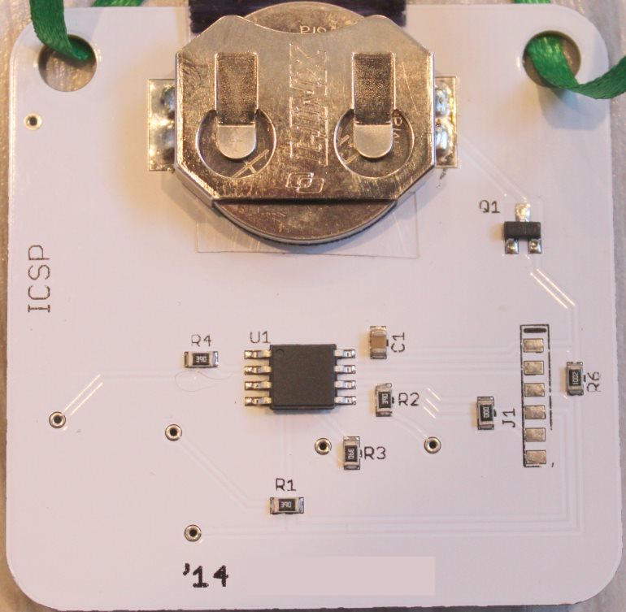
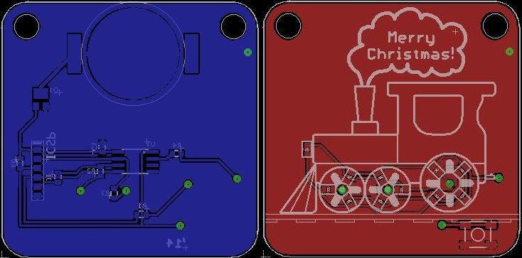
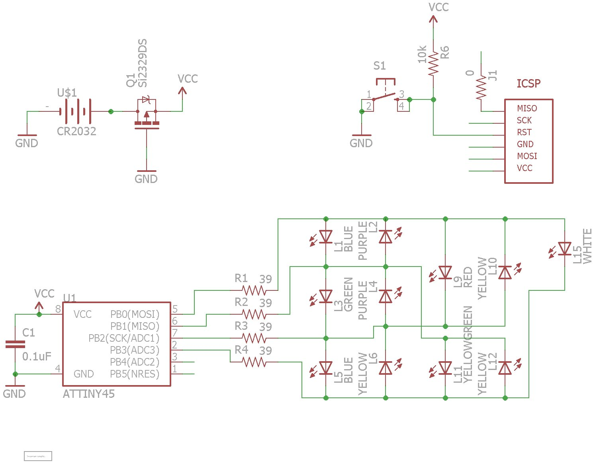
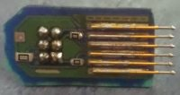

This is the second ornament in my DIY ornament series, the **Choo Choo Train**

***

This ornament is very similar to the [original 2013 ornament](https://github.com/ChristmasOrnaments/2013-Snowman), with only a few minor changes. The image in the silkscreen has changed (it's a train). The locations of the LEDs have change, and so the patterns that it produces were also changed to represent the wheels of the train in motion. Another change was to the ICSP header on the board. I made a small [pogo-pin adapter](https://github.com/timtilities/Pogo-Pin-ICSP-Adapter) so the header wouldn't take up as much room. It's much easier to use (and also easier to design board traces around). I also removed the extra LED from the back of the board, since I never used it. I had intended to use it as a "low battery" indicator, but the brightness of the LEDs does a fine job of that anyway.

Here are the pics:

 

 

The new pogo adapter:

Here's a small video of the board in action:
https://github.com/user-attachments/assets/bbaf6b06-1da1-494d-bd4b-d39d66976917

### Compiling

* Install [ATTinyCore](https://github.com/spencekonde/attinycore) using the boards manager
* Select **Attiny25/45/85 (No bootloader)** from the boards list
* Set the *Clock source* to **4MHz (internal)** (With newer versions, you may need to use 8MHz with a scalar variable to lower it to 4MHz)
* Set *B.O.D* to **Disabled**
* Select **Burn Bootloader** to write the changes
* Compile and write the program to the MCU

If using another method to program the MCU, just remember you need to set the fuses properly both for correct speed and for the power saving features. The fuses (for an ATTINY45) should be:

Low: C3  
High: DF  
Extended: FF

You can see the effect of different fuse settings (and their values) [here](http://www.engbedded.com/fusecalc/).

### Resources

**Charlieplexing Code using a byte array:**  
[https://www.instructables.com/CharliePlexed-LED-string-for-the-Arduino/](https://www.instructables.com/CharliePlexed-LED-string-for-the-Arduino/)

**Battery calculator:**  
[http://oregonembedded.com/batterycalc.htm](http://oregonembedded.com/batterycalc.htm)

**Power saving information:**  
[http://www.gammon.com.au/forum/?id=11497](http://www.gammon.com.au/forum/?id=11497)  
[http://www.insidegadgets.com/2011/02/05/reduce-attiny-power-consumption-by-sleeping-with-the-watchdog-timer](http://www.insidegadgets.com/2011/02/05/reduce-attiny-power-consumption-by-sleeping-with-the-watchdog-timer/)  
[http://www.nongnu.org/avr-libc/user-manual/group\_\_avr\_\_power.html](http://www.nongnu.org/avr-libc/user-manual/group__avr__power.html)
